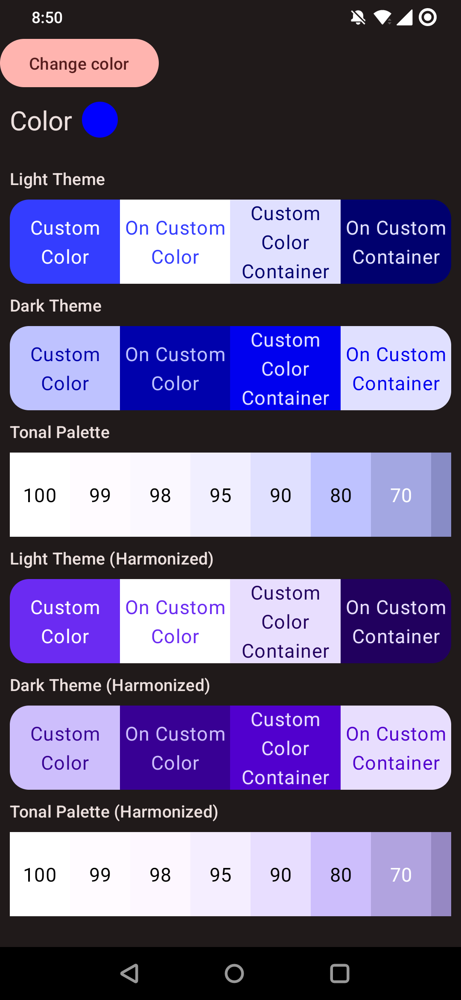

# Compose Custom Colors

Material design 3 custom colors with Jetpack Compose. Harmonization is enabled by default.



## Usage

```kotlin
@Composable
fun Example() {
    CustomColorScheme(color = Color.Yellow) { // darkTheme = isSystemInDarkTheme(), harmonize = true
        Column {
            Item()
        }
    }
}

@Composable
private fun Item(){
    val colorScheme = LocalCustomColorScheme.current

    Surface(
        color = colorScheme.customColorContainer
    ) {
        Text(
            text = "Example item",
            color = colorScheme.onCustomColorContainer
        )
    }
}
```

## Import

In `settings.gradle.kts`, add `maven { setUrl("https://jitpack.io") }`.

```kotlin
dependencyResolutionManagement {
    repositoriesMode.set(RepositoriesMode.FAIL_ON_PROJECT_REPOS)
    repositories {
        google()
        mavenCentral()

        maven { setUrl("https://jitpack.io") }
    }
}
```

Add dependency.

```kotlin
dependencies {
    implementation("com.github.bogdan-pechounov:compose-custom-colors:0.5.1")
}
```

## Questions

depend only on primary
change text selection
